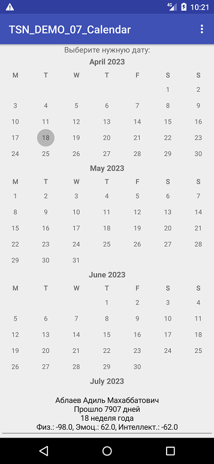

# Лабораторная работа 1, 2 семестр
# Аблаев Адиль CS-204(с) 

Программа просчитывает биоритмы человека по дате рождения, и количество дней, прошеднших от одной даты до другой.

## Скриншоты программы:

